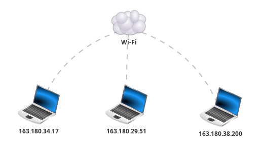

# Le réseau

**ARPANET** est l’acronyme du premier réseau à transfert de paquets de données conçu aux États-Unis par la DARPA. Le projet fut lancé en 1966, mais ARPANET ne vit le jour qu’en 1969. Sa première démonstration officielle date d’octobre 1972.

<center>
    
</center>

!!! note "Un peu d'histoire"

    Le premier message, le simple mot « login », sera envoyé sur le réseau le 29 octobre 1969 
    à 22 h 36.  
    Mais, à la suite d’un bug, les trois dernières lettres mettront une heure pour arriver.

Tout au long de ce TP, nous utiliserons le logiciel **Filius**.

## Pour commencer

### Communiquer sur un réseau

Pour communiquer sur un réseau, il faut déjà y être connecté.

#### Premier test

On considère deux ordinateurs reliés entre eux via un câble comme sur la figure ci-dessous :

<center>
    
</center>

!!! question "Manipulations"

    - Réaliser ce réseau sur Filius ;
    - Sur le poste de gauche, installer la **ligne de commande** ;
    - Pinger le poste de droite à l'aide de la commande **ping 192.168.1.2** ;
    - Changer l'adresse IP du poste de droite en **192.168.2.1** ;
    - Tenter à nouveau de pinger le poste de droite depuis le poste de gauche.


??? warning "Important"

    Pour que deux postes puissent communiquer, il faut qu'ils soient sur le même réseau !

#### Plus étoffé

On considère trois ordinateurs, tous reliés à un réseau Wifi comme sur la figure ci-dessous :

<center>
    
</center>

Vous pouvez télécharger le fichier filius directement en cliquant [ici](./files/reseau2.fls).

!!! question "Manipulations"

    - Vérifier que le poste de gauche et le poste central sont connecté au même réseau.
    - Vérifier que le poste de gauche et le poste de droite ne peuvent pas communiquer.
    - Expliquer pourquoi.

??? warning "Important"

    Il est très important de regarder le masque pour identifier si deux postes sont sur le même réseau.

### Notions autour du PING

Ping est le nom d'une commande informatique permettant de tester l'accessibilité d'une autre machine à travers un réseau IP.  
Il utilise une requête ICMP Request et attend une réponse Reply. L'envoi est répété pour des fins statistiques : déterminer le taux de paquets perdus et le délai moyen de réponse.

Avant l'envoi de la requête ICMP, l'ordinateur émetteur envoie une requête ARP pour déterminer l'adresse physique de la cible.

On considère à nouveau trois ordinateurs, tous reliés à un réseau Wifi comme sur la figure ci-dessous :

<center>
    
</center>

Vous pouvez télécharger le fichier filius directement en cliquant [ici](./files/reseau3.fls).

!!! question "Manipulations"

    - Réaliser un clic-droit sur l'ordinateur de gauche et cliquer sur **Afficher les échanges de données** ;
    - Répéter l'opération pour les deux autres ordinateurs ;
    - Pinger l'ordinateur de droite depuis celui de gauche ;
    - Observer les requêtes ARP et ICMP sur chacun des trois postes.

### Création de sous-réseaux

On s'intéresse à la création de sous-réseau dans une maison composée de trois chambres.  
La box de la maison fournit un réseau local **192.168.1.0/24**. Un modèle est donné ci-dessous :

<center>
    
</center>

Vous pouvez télécharger le fichier filius directement en cliquant [ici](./files/reseau4.fls).

!!! question "Manipulations"

    - Vérifier que le PC1 peut communiquer avec le PC2 ;
    - Modifier les adresses IP et les masques pour isoler chacune des chambres dans son propre sous-réseau.

## Le routage

Un routeur est un équipement réseau informatique assurant le routage des paquets. Son rôle est de faire transiter des paquets d'une interface réseau vers leur destination, au mieux, selon un ensemble de règles.

### Connecter des réseaux

Le routeur est l'équipement idéal pour connecter des réseaux entre-eux.

On possède trois réseaux distincts reliés à un routeur comme ci-dessous :

<center>
    
</center>

Vous pouvez télécharger le fichier filius directement en cliquant [ici](./files/reseau5.fls).

!!! question "Manipulations"

    - Activer le routage automatique du routeur ;
    - Donner une adresse IP à chacune des trois interfaces du routeur ;

        ??? warning "Attention"

            L'adresse IP associée à une interface doit être dans le même réseau que le réseau auquel l'interface est connectée.

    - Régler les passerelles par défaut de chacun des ordinateurs ;

        ??? warning "Attention"

            Les passerelles correspondent à l'adresse IP de l'interface du routeur à laquelle le réseau est connecté.

    - Afficher les échanges de données pour les postes d'IP **192.168.2.1** et **192.168.3.1** ;
    - Pinger depuis **192.168.1.1** vers **192.168.3.1** ;
    - Observer qui reçoit les requêtes ARP et trouver une explication ;

        ??? warning "Important"

            Les requêtes ARP ne sont pas routables !!! C'est le routeur qui envoie son adresse MAC !!!

### Les tables de routage

Il est possible de ne pas imposer le routage automatique à un routeur.  
Il faut par contre remplir soi-même les tables de routage pour que les paquets puissent transiter.

On possède trois routeurs inter-connectés comme dans le modèle ci-dessous :

<center>
    
</center>

Vous pouvez télécharger le fichier filius directement en cliquant [ici](./files/reseau6.fls).

!!! question "Manipulations"

    - Commencer par identifier les six réseaux mis en jeu dans ce fichier ;
    - Lorsque le PC **192.168.1.1** souhaite communiquer avec le PC **192.168.2.1**, on souhaite que les données transitent par les routeurs A puis B :

        - Cliquer alors sur le routeur A ;
        - Observer qu'il n'y a pas de ligne pour le réseau **192.168.2.0** ;
        - Ajouter la ligne suivante :

            | **IP de destination** | **Masque**    | **Passerelle suivante** | **Via l'interface** |
            |-----------------------|---------------|-------------------------|---------------------|
            | 192.168.2.0           | 255.255.255.0 | 192.168.5.2             | 192.168.5.1         |
            
        - Régler alors les tables de routages des trois routeurs pour que chaque réseau puisse communiquer entre eux


## Pour aller plus loin

### Serveur WEB

Un serveur web est un serveur informatique qui répond à des requêtes du World Wide Web sur un réseau public (Internet) ou privé (intranet) en utilisant principalement le protocole HTTP.

On s'intéresse dans ce cas à un réseau simple comme dans le modèle ci-dessous :

<center>
    
</center>

!!! question "Manipulations"

    - installer sur l'ordinateur :
        
        - un serveur WEB ;
        - un explorateur de fichiers ;
        - un éditeur de textes ;
         
        puis sur le portable :
     
        - un navigateur WEB.
    
    - Modifier le fichier **index.html** du serveur et coller le code :
   
        ```html title="Page Web" linenums="1"

        <html>
            <head>
                <title>Formulaires HTML</title>
            </head>
            
            <body>
                <h1>Les formulaires HTML</h1>
                
                <form method="post" action="traitement.html">
                    <label for="pseudo">Entrez un pseudo : </label>
                    <input type="text" name="pseudo" id="pseudo"><br><br>
                        
                    <label for="password">Mot de passe : </label>
                    <textarea name="prez" id="password"></textarea><br><br>
                        
                    <input type="submit" value="Envoyer">
                </form>
            </body>
        </html>
        ```
         
    - Créer la page **traitement.html** avec le code :

        ``` html title="Page Web" linenums="1"

        <html>
            <head>
                <title>Formulaires HTML</title>
            </head>

            <body>
                <h1>Les formulaires HTML</h1>
                Bonjour.
            </body>
        </html>
        ``` 

    - Activer le serveur WEB et depuis le navigateur du client, aller sur le site **http://192.168.1.20**.
    - Observer les données échangées et retrouver le login et le mot de passe utilisés sur la page.

### Notion de DNS

Les équipements connectés à un réseau IP, comme Internet, possèdent une adresse IP qui les identifie sur le réseau. Ces adresses sont numériques afin de faciliter leur traitement par les machines. Pour faciliter l'accès aux hôtes sur un réseau IP, un mécanisme a été mis en place pour associer un nom à une adresse IP. Ce nom, plus simple à retenir, est appelé « nom de domaine ». Résoudre un nom de domaine consiste à trouver l'adresse IP qui lui est associée. C'est le rôle des DNS.

!!! question "Manipulations"

    - Modifier le réseau précédent pour y intégrer un nouveau serveur et y installer un serveur DNS :

        <center>
            
        </center>
        
    - Activer le serveur DNS en ajoutant l'association **192.168.1.20 / www.colbert-nsi.com**
    - Aller sur **www.colbert-nsi.com** depuis le portable et observer les échanges sur ce poste.
   
### Un problème complet

On possède une vue d'ensemble d'un réseau global :

<center>
    
</center>
   
Les routeurs dans le cadre jaune constituent ce qu'on appelle **un système autonome** avec la présence de :

- routeurs de bords, configurés manuellement et qui donne accès au système ;

- routeurs internes, configurés en routage automatique.
    
Dans la partie gauche, une habitation avec :

- une box orange reliée au réseau internet ;

- six portables avec des adresses IP privées qui ne sont pas connectées directement à internet.

Vous pouvez télécharger le fichier filius directement en cliquant [ici](./files/reseau6.fls).

!!! question  "Manipulations"
    
    - Réaliser un découpage en sous-réseau du réseau domestique pour que les zones définies dans le fichier soit considérée comme des sous-réseaux ;
            
    - Indiquer les passerelles par défaut pour la box orange ainsi que pour les deux routeurs de bord.

    - Terminer la configuration du serveur DNS et du serveur Web et créer une page web accessible depuis l'adresse **http://www.google.fr** ;